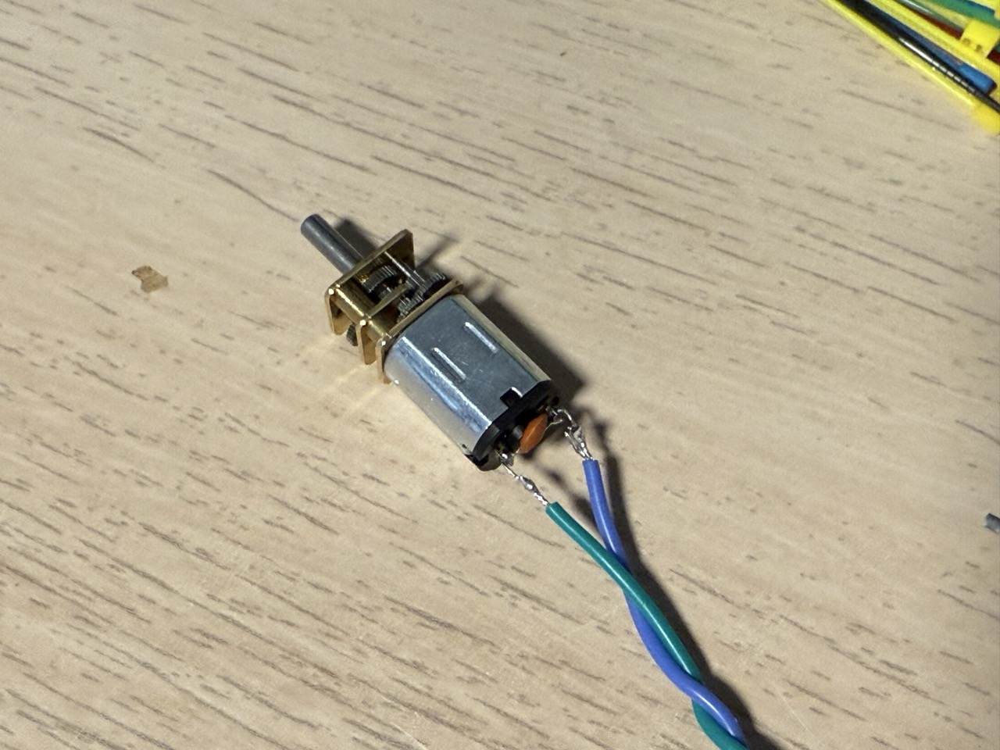
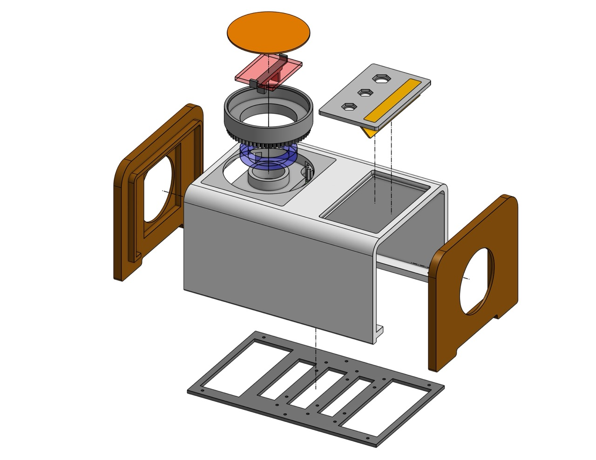

# Record Player

A real player that plays fake records.

Source on [GitHub](https://github.com/lennyomg/recordplayer).

[](https://www.youtube.com/watch?v=qOQR8iDCI8Y)

This is [Owntone](https://owntone.github.io/owntone-server/) media server in retro-style body. It plays local files and streams Spotify to local speakers or Apple HomePods. Disks are NFC tags. A Python application connects the NFC reader, LED lights, input controls, and controls Owntone using its RESTful API. Everything is running on a headless Raspberry Pi with a little help from a CircuitPython development board. And a small motor inside spins a disk.

### Raspberry Pi

The shell has mounting holes for Pi Zero and Pi Model 3 A+. Pi Zero has a longer booting time, but takes up less space. Pi 3 generates more heat, but is more responsive and Wi-Fi is better. I choose Pi Zero W 2 for now. It hiccups sometimes, but I can live with that.

Get an SD card and [flash](https://www.raspberrypi.com/software/) it with Raspberry Pi OS Bookworm Lite 64-bit. I had mixed results with Bullseye. Add these two lines in config.txt to enable [SPI](https://learn.adafruit.com/circuitpython-on-raspberrypi-linux/spi-sensors-devices) and [UART](https://learn.adafruit.com/circuitpython-on-raspberrypi-linux/uart-serial).

```
dtparam=spi=on
enable_uart=1
```

### Audio


The Pi Model 3 A+ has a 3.5mm headphone jack, but it is no good. Audio I2S HAT is the way to go. I've got [Adafruit I2S 3W Stereo Speaker Bonnet](https://www.adafruit.com/product/3346). This [guide](https://learn.adafruit.com/adafruit-speaker-bonnet-for-raspberry-pi) should work for all I2S HATs.

As for speakers - any 3W or 5W will do. I salvaged mine from an [Amazon Basic Speaker](https://www.amazon.com/dp/B07D7TV5J3), which I had from one of my previous projects. Sound quality is... good enough. Glue the speakers into the side walls with a hot glue gun.

### Motor




Take an [N20 DC motor](https://www.amazon.com/dp/B07FYBQ7Z4) that works from 6V and has a speed of 10-30 RPM. Optionally, solder a ceramic capacitor between the motor terminals to reduce noise and smooth spinning at low speeds. Do not lube the motor with liquid oil; it makes the noise worse.

To control the motor, I use [L9110H H-Bridge Motor Driver](https://www.adafruit.com/product/4489) (pay attention to the pinout in the [datasheet](https://cdn-shop.adafruit.com/product-files/4489/4489_datasheet-l9110.pdf)). It protects the Pi from back EMF and spins the motor forward and backward.

CAUTION: Never connect a DC motor directly to Pi GPIOs. It might work, but you can fry your Pi because of back EMF and high current usage.

The spinning part of the shell is connected to the panel with a [30x42x7mm bearing](https://www.amazon.com/dp/B082PXK5K9).

In case you need to print a custom gear:
*  Pitch circle diameter: 60mm and 12mm
*  Number of teeth: 60 and 12
*  Module: 1mm

The motor mount is designed to be detachable, so you can design and print your own mount and then screw it to the body with two M2 screws. Add some anti-vibration material like rubber or foam between the mount and the shell to reduce noise.

### Disks

 


This is where the magic happens. Each printed disk has [a small NFC sticker tag](https://www.amazon.com/dp/B075CFXY8V) under the cover. An NFC reader is located inside the spinning part, but the reader doesn't spin! Each tag id is associated with an album or playlist in Owntone.

PN532 is a common choice for an NFC reader, but most of them are too big for this project. I recommend [this board from HiLetgo;](https://www.amazon.com/dp/B01I1J17LC) it is small and fits nicely into the spinning part.

You must use the SPI interface with PN532. The I2C interface on this chip doesn't work reliably with Raspberry Pi because of [I2C clock stretching](https://learn.adafruit.com/working-with-i2c-devices/clock-stretching). Configure the NFC module to use SPI by physically flipping an SMB header on the PCB.

Print covers on sticky paper with a size of 70x70mm, stick them to a disk, and cut them with a razor knife.

### Controls


Three knobs on the control panel are:

A rotary switch, ideally 1P3T. I have [2P6T](https://www.amazon.com/dp/B074WLW121) with a limiter, so it has only 3 positions:
1. Enable "turn off" for PowerBoost.
2. Select local speakers.
3. Select remote speakers.

A generic potentiometer with an internal switch, like [this one.](https://www.adafruit.com/product/3395) The potentiometer controls volume, the switch acts like mute.

A generic [rotary encoder](https://www.amazon.com/dp/B08728K3YB) for skipping tracks and play/pause.

To add some light, I cut 10 LEDs from this [WS2812B 144-LED 3.3-foot strip](https://www.amazon.com/dp/B09PBGZMNS). I think any NeoPixel strip will work. Adafruit has an [excellent guide](https://learn.adafruit.com/adafruit-neopixel-uberguide/the-magic-of-neopixels) about it.

### Power


CAUTION: Always check battery polarity with a voltmeter before connecting it.

I have a 10000 mAh Li-Po battery, but if I were you, I\'d go with 5000 mAh. [PowerBoost 1000 Charger](https://www.adafruit.com/product/2465) provides stable 5V and charges the battery fast. There are much more [affordable](https://www.adafruit.com/product/1903) options, but again, it is what I had already. The PowerBoost is connected to a [USB-C breakout with CC resistors](https://www.amazon.com/dp/B096M2HQLK). The mount for the USB breakout is a separate part, so you can design your own and print it without re-printing the whole shell.

Skip the PowerBoost if you don't need a battery. Just connect VS and GND from your USB-C connector to the Pi power pins.

### Wiring


[Perma-Proto](https://www.adafruit.com/product/2310) is amazing. Do yourself a favor and use JST connectors on the protoboard. It is much easier to assemble and disassemble the project this way. Carefully follow the schematic and solder everything together. Pay attention to component orientation.

Here is a list of materials I used:
* [26 AWG](https://www.amazon.com/dp/B089CZFDX2) wires for power lines and audio
* [30 AWG](https://www.amazon.com/dp/B089D31ZX6) wires for data lines
* [2.54mm JST connectors](https://www.amazon.com/dp/B09DFM29FV)
* [Jumper wires](https://www.amazon.com/dp/B08YRGVYPV) for the protoboard
* [Standoff screws](https://www.amazon.com/dp/B0BXT4FG1T)

Do not use pins #18, #19, #21 - they are reserved for I2S audio.

### Printing and assembling




Main body is Basic PLA. Side panels are Bambu PLA Wood. LED defuser is translucent PETG. I printed everything in 0.16 High Quality profile with Bambu A1 Mini. Depending on body color, you may want to increase infill up to 75% (grid) to avoid light-bleeding from LEDs. Top parts must snap into place. Side walls or any other loose parts can be secured with thin double-sided tape. Bottom panel is fixed with six [M2](https://www.amazon.com/dp/B089QX453K) screws.

### Owntone

Follow Owntone [documentation](https://owntone.github.io/owntone-server/building/) on how to build and configure it. It is actually not that difficult.

Install dependencies.

```
sudo apt-get install \
  build-essential git autotools-dev autoconf automake libtool gettext gawk \
  gperf bison flex libconfuse-dev libunistring-dev libsqlite3-dev \
  libavcodec-dev libavformat-dev libavfilter-dev libswscale-dev libavutil-dev \
  libasound2-dev libxml2-dev libgcrypt20-dev libavahi-client-dev zlib1g-dev \
  libevent-dev libplist-dev libsodium-dev libjson-c-dev libwebsockets-dev \
  libcurl4-openssl-dev libprotobuf-c-dev
```

Clone repository.

```
cd \~
git clone https://github.com/owntone/owntone-server.git
cd owntone-server
```

Instead of building from the master branch, switch to a release using tags.

```
git switch 2.8.2
```

Build.

```
autoreconf -i
./configure --prefix=/usr --sysconfdir=/etc --localstatedir=/var --enable-install-user
make
sudo make install
```

Go through the config file and update settings according to your needs.

```
sudo nano /etc/owntone.conf
```

I only changed Spotify settings.

```
spotify {
  bitrate = 3
  base_playlist_disable = true
  artist_override = true
  album_override = true
}
```

Create music folder.

```
mkdir /srv/music
sudo chmod -R 777 /srv/music
```

Enable Owntone service.

```
sudo systemctl enable owntone.service
sudo systemctl start owntone.service
```

Now Owntone should be available at `http://<pi-host-name>:3689`.

### Spotify

In Owntone interface, you should log in to Spotify, as it is described in [the official guide](https://owntone.github.io/owntone-server/integrations/spotify/). Every time OwnTone is started (every time you turn on Pi), it loads all saved playlists from Spotify; it surely takes time. I use a dedicated account in the family plan with only playlists I listen to.

### Satellite board

Take one of [Seeed XIAO](https://www.seeedstudio.com/test-for-xiao.html) or [Adafruit QT Py](https://www.adafruit.com/category/595) boards just because they are small. RP2040-based boards usually cost less. I use XIAO nRF52840 in this project. The board does two things: controls NeoPixel LED strip and reads analog input. Also, as the board starts instantly, I can now play a LED animation while the Pi is booting.

Flash your board with CircuitPython firmware, find the right one on [circuitpython.org](http://circuitpython.org). It should be detected as a thumb drive when connected to a computer. Learn more on [Adafruit](https://learn.adafruit.com/welcome-to-circuitpython/what-is-circuitpython).

Install libraries to the board (run on your computer, not on the Pi).

```
pip install circup
circup install neopixel
circup install adafruit_led_animation
circup install adafruit_ticks
circup install adafruit_led_animation
```

Now copy Python files from src/board to the board, and it is done.

CAUTION: Do not connect the board to your computer while it is powered by another power source. You may back-power the USB controller inside your computer and burn it.

### Control app

Copy everything from `src` to `~/recordplayer` on the Pi.

Activate environment.

```
cd ~/recordplayer
sudo apt install python3-dev libgpiod-dev python3-libgpiod 
python -m venv .venv
source .venv/bin/activate
pip install -r requirements.txt
sudo chmod 777 ./run
echo @reboot ~/recordplayer/run | crontab -
```

Find available speakers and outputs.
```
python pi/outputs.py
```
Insert IDs of remote speakers that you want to use into OUTPUTS in `playback.py`. Keep \"0\" - it is for local speakers.

```
OUTPUTS = [
    ["0"],
    ["remote_output_id", "another_remote_id_if_any"],
]
```

Test it.

```
./run
```

### Library

In `library.py`, you find a list of NFC tag IDs with associated
playlists and albums.

```
playlists = {
    "rfid_id": {
        "uris": "library:album:123456789",
        "shuffle": "false",
    },
    "04422601654003": {
        "uris": "spotify:playlist:37i9dQZF1DWUrmUI5ur5GK",
        "shuffle": "true"
    },
}
```

Place NFC tag on the reader, run the command below, and you will see the tag ID. Copy it and use it in `library.py`.

```
journalctl /usr/bin/python
```

Spotify URIs are regular Spotify URIs; you can find them in Owntone UI.


Owntone doesn't show URIs for albums; you need to extract it from the URL. Open an album in a browser, copy the URL, and change it from `http://recordplayer:3689/#/music/albums/8249546791409011466` to `library:album:8249546791409011466`.


Restart Pi after making changes in `library.py`.

### Conclusion

Done. Enjoy.
